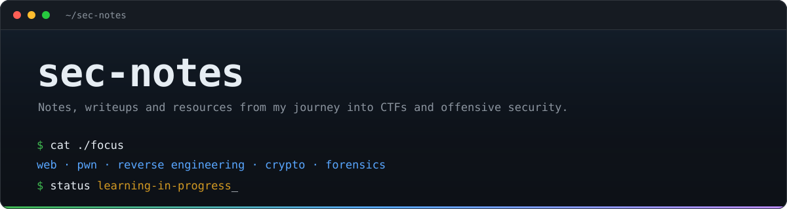

 

 

**A working repository — notes, writeups, and a curated map of where to actually learn this.**

---

## Contents

- [Repository layout](#repository-layout)
- [CTF platforms](#ctf-platforms)
  - [Practice platforms](#practice-platforms)
  - [Wargames and fundamentals](#wargames-and-fundamentals)
  - [Web](#web)
  - [Cryptography](#cryptography)
  - [Binary exploitation](#binary-exploitation)
  - [Reverse engineering](#reverse-engineering)
  - [Forensics, DFIR and blue team](#forensics-dfir-and-blue-team)
  - [OSINT](#osint)
  - [Competitions](#competitions)
  - [Bug bounty](#bug-bounty)
- [YouTube channels](#youtube-channels)
- [Courses and learning sites](#courses-and-learning-sites)
- [References and cheatsheets](#references-and-cheatsheets)
- [Scope and ethics](#scope-and-ethics)
- [License](#license)

---

## Repository layout

| Directory | Contents |
|---|---|
| [`books/`](books/README.md) | Annotated bibliography — 37 titles across 11 areas, with reading status |
| [`notes/`](notes/README.md) | Theory in my own words, by domain |
| [`writeups/`](writeups/README.md) | Retired boxes and challenges, tagged by technique |
| [`cheatsheets/`](cheatsheets/README.md) | Syntax and payloads already understood, kept for recall |
| [`tools/`](tools/README.md) | Scripts written for my own workflow |
| [`.templates/`](.templates/) | Starting points for a new note or writeup |

Writing conventions live in [CONTRIBUTING.md](CONTRIBUTING.md). Directories fill in as material is written — a missing subfolder means "not written yet".

---

## CTF platforms

Grouped by *how you practise*, not by difficulty — most platforms span the whole range, so difficulty is a column instead.

### Practice platforms

Always-on machines and challenges.

| Platform | Focus | Difficulty | Cost | Why |
|---|---|---|---|---|
| [Hack The Box](https://www.hackthebox.com/) | Machines, challenges, Pro Labs | Easy → Insane | Freemium | The reference platform. Start with Starting Point, then Seasonal machines |
| [HTB Academy](https://academy.hackthebox.com/) | Guided modules, CPTS/CBBH paths | Beginner → Advanced | Freemium | The theory half of HTB. Modules explain what the machines assume |
| [TryHackMe](https://tryhackme.com/) | Guided rooms and paths | Beginner → Intermediate | Freemium | Best on-ramp. Teaches prerequisites in order instead of dropping you on a box |
| [picoCTF](https://www.picoctf.org/) | Jeopardy challenges, permanent gym | Beginner | Free | Built by CMU. The classic first CTF, and the archive stays open year-round |
| [Root-Me](https://www.root-me.org/) | 500+ challenges, every category | Beginner → Advanced | Free | Unmatched breadth per category; excellent for drilling one weak area |
| [VulnHub](https://www.vulnhub.com/) | Downloadable vulnerable VMs | Beginner → Advanced | Free | Runs entirely offline in your own lab, no subscription, no VPN |
| [HackMyVM](https://hackmyvm.eu/) | Downloadable VMs with rankings | Beginner → Advanced | Free | VulnHub's model plus a scoreboard to keep you honest |
| [Vulnlab](https://www.vulnlab.com/) | Machines and Active Directory chains | Intermediate → Advanced | Paid | The strongest AD practice available outside a real engagement |
| [OffSec Proving Grounds](https://www.offsec.com/labs/) | OSCP-style boxes | Intermediate | Freemium | Play tier is free; closest thing to exam conditions |
| [PentesterLab](https://pentesterlab.com/) | Web exercises built on real CVEs | Beginner → Advanced | Freemium | Every exercise is an actual historical vulnerability, not a toy |
| [CTFlearn](https://ctflearn.com/) | Community jeopardy challenges | Beginner | Free | Low friction, good for daily reps |
| [247CTF](https://247ctf.com/) | Always-on jeopardy CTF | Beginner → Advanced | Free | Permanent challenges, no event calendar to wait for |
| [Hack This Site](https://www.hackthissite.org/) | Web and basic missions | Beginner | Free | Dated, but the progression still teaches the right instincts |

### Wargames and fundamentals

Shell, Linux and low-level muscle memory.

| Platform | Focus | Difficulty | Cost | Why |
|---|---|---|---|---|
| [OverTheWire](https://overthewire.org/wargames/) | Linux, networking, binaries over SSH | Beginner → Advanced | Free | Bandit is the canonical first wargame. Do it before anything else |
| [pwn.college](https://pwn.college/) | Full ASU curriculum, video plus labs | Beginner → Advanced | Free | The best free structured path into binary exploitation, full stop |
| [Exploit Education](https://exploit.education/) | Nebula, Phoenix — memory corruption | Beginner → Intermediate | Free | Purpose-built VMs that isolate one exploitation concept at a time |
| [Under the Wire](https://underthewire.tech/) | PowerShell wargames | Beginner → Intermediate | Free | The Windows answer to Bandit, and the Windows side is usually neglected |
| [SmashTheStack](http://smashthestack.org/) | Classic SSH wargames | Intermediate | Free | Old-school, long-running, still instructive |
| [WeChall](https://www.wechall.net/) | Challenge aggregator and rankings | All | Free | Links your score across dozens of sites into one profile |
| [cmdchallenge](https://cmdchallenge.com/) | One-line shell puzzles | Beginner | Free | Sharpens shell fluency faster than any tutorial |
| [SadServers](https://sadservers.com/) | Break/fix Linux scenarios | Intermediate | Freemium | Troubleshooting a broken box under time pressure |

### Web

| Resource | Focus | Cost | Why |
|---|---|---|---|
| [PortSwigger Web Security Academy](https://portswigger.net/web-security) | Full web curriculum with labs | Free | Best free security course on the internet, in any category. Written by the Burp team |
| [Hacker101](https://www.hacker101.com/) + [CTF](https://ctf.hacker101.com/) | Course plus CTF | Free | HackerOne's own training. CTF flags unlock private programme invites |
| [OWASP Juice Shop](https://owasp.org/www-project-juice-shop/) | Modern vulnerable SPA | Free | Self-hosted, covers the whole OWASP Top 10 in a realistic app |
| [DVWA](https://github.com/digininja/DVWA) | Classic vulnerable PHP app | Free | Adjustable security levels make it good for seeing *why* a fix works |
| [alert(1) to win](https://alf.nu/alert1) | XSS filter bypass puzzles | Free | Pure filter-evasion drilling, nothing else |
| [Websec.fr](https://websec.fr/) | Hard PHP and web challenges | Free | Where you go once Juice Shop stops being interesting |
| [Google Gruyere](https://google-gruyere.appspot.com/) | Web security codelab | Free | Find, exploit, then patch — the patching half is the valuable part |
| [XSS Game](https://xss-game.appspot.com/) | XSS introduction | Free | Six levels, one afternoon, solid foundations |

### Cryptography

| Resource | Focus | Difficulty | Cost | Why |
|---|---|---|---|---|
| [CryptoHack](https://cryptohack.org/) | Modern crypto, gamified | Beginner → Advanced | Free | Teaches attacks on real primitives, not textbook ciphers |
| [Cryptopals](https://cryptopals.com/) | 8 sets, implemented by you | Intermediate → Advanced | Free | You write every attack from scratch. Slow, and the fastest way to actually learn |
| [MysteryTwister](https://mysterytwister.org/) | Classical through research-level | All | Free | Ranges from Caesar to genuinely unsolved problems |

### Binary exploitation

| Resource | Focus | Difficulty | Cost | Why |
|---|---|---|---|---|
| [ROP Emporium](https://ropemporium.com/) | Return-oriented programming only | Intermediate | Free | One ROP concept per challenge, across architectures |
| [Nightmare](https://guyinatuxedo.github.io/) | Intro course built from CTF problems | Beginner → Advanced | Free | Book-length free course that goes from stack smashing to heap |
| [pwnable.kr](http://pwnable.kr/) | Classic pwn wargame | Beginner → Advanced | Free | The canonical set. Start with `fd` |
| [pwnable.tw](https://pwnable.tw/) | Harder successor | Advanced | Free | Modern mitigations, no hand-holding |
| [pwnable.xyz](https://pwnable.xyz/) | Modern heap and Linux pwn | Intermediate → Advanced | Free | Focused on contemporary heap exploitation |
| [Microcorruption](https://microcorruption.com/) | Embedded MSP430, in-browser debugger | Beginner → Advanced | Free | Embedded exploitation with zero setup. Superb difficulty curve |

### Reverse engineering

| Resource | Focus | Difficulty | Cost | Why |
|---|---|---|---|---|
| [crackmes.one](https://crackmes.one/) | Community crackmes | Beginner → Advanced | Free | Thousands of binaries, filterable by difficulty and platform |
| [Flare-On](https://flare-on.com/) | Mandiant's annual RE challenge | Advanced | Free | Every past edition is downloadable with official solutions |
| [Reversing.kr](http://reversing.kr/) | Classic RE challenge set | Intermediate | Free | Small, sharp, well-designed |
| [RE101 — Malware Unicorn](https://malwareunicorn.org/workshops/re101.html) | Malware RE workshop | Beginner | Free | The workshop that got a generation started |
| [Reverse Engineering for Beginners](https://beginners.re/) | Yurichev's free book | Beginner → Advanced | Free | 1000+ pages, free, and the assembly reference you keep returning to |

### Forensics, DFIR and blue team

Knowing how you get caught makes you better at not getting caught.

| Resource | Focus | Cost | Why |
|---|---|---|---|
| [CyberDefenders](https://cyberdefenders.org/) | Blue-team DFIR labs | Freemium | Realistic investigations built on real artefacts |
| [Blue Team Labs Online](https://blueteamlabs.online/) | Investigations and SOC scenarios | Freemium | Structured cases with grading |
| [LetsDefend](https://letsdefend.io/) | SOC analyst simulation | Freemium | Alert triage against a simulated queue |
| [Digital Corpora](https://digitalcorpora.org/) | Real forensic disk and memory images | Free | Full corpora for practising on non-trivial data |
| [Ali Hadi's DFIR challenges](https://www.ashemery.com/dfir.html) | Memory and disk cases | Free | Free case files with questions to work through |
| [vx-underground](https://vx-underground.org/) | Malware sample archive and papers | Free | Live samples — **isolated VM only, never your host** |

### OSINT

| Resource | Focus | Cost | Why |
|---|---|---|---|
| [Trace Labs](https://tracelabs.org/) | Missing-persons OSINT CTFs | Free | Real cases, real impact, run with law enforcement |
| [OSINT Framework](https://osintframework.com/) | Tool directory by objective | Free | Answers "what tool for this question" |

### Competitions

| Resource | Focus | Why |
|---|---|---|
| [CTFtime](https://ctftime.org/) | Calendar, team rankings, writeup archive | Where every event is announced and every writeup is indexed |
| [Google CTF](https://capturetheflag.withgoogle.com/) | Annual event plus Beginners Quest | The Beginners Quest is one of the best-designed intro sets anywhere |
| [Flare-On](https://flare-on.com/) | Annual RE competition | Six weeks, escalating difficulty, archived forever |

### Bug bounty

| Platform | Notes |
|---|---|
| [HackerOne](https://www.hackerone.com/) | Largest programme catalogue; [Hacktivity](https://hackerone.com/hacktivity) publishes disclosed reports worth studying |
| [Bugcrowd](https://www.bugcrowd.com/) | Strong VDP presence and a useful methodology library |
| [Intigriti](https://www.intigriti.com/) | Europe-focused, active community, runs its own CTFs |
| [YesWeHack](https://www.yeswehack.com/) | European platform with a free training arm |

---

## YouTube channels

### CTF and machine walkthroughs

| Channel | Why |
|---|---|
| [IppSec](https://www.youtube.com/@ippsec) | A walkthrough for every retired HTB machine. The gold standard — and [ippsec.rocks](https://ippsec.rocks/) searches his videos by technique |
| [John Hammond](https://www.youtube.com/@_JohnHammond) | CTF solves, malware breakdowns, and unusually clear explanations of unusual bugs |
| [CryptoCat](https://www.youtube.com/@_CryptoCat) | Pwn-heavy CTF walkthroughs with pwntools and Ghidra, start to finish |
| [Almond Force](https://www.youtube.com/@almondforce) | Calm, methodical HTB and THM walkthroughs |
| [MurmusCTF](https://www.youtube.com/@MurmusCTF) | Live CTF solving, including the parts that go wrong |

### Low-level and exploitation

| Channel | Why |
|---|---|
| [LiveOverflow](https://www.youtube.com/@LiveOverflow) | The channel that taught a generation to think about *why* exploits work |
| [PwnFunction](https://www.youtube.com/@PwnFunction) | Animated explanations of web vulnerability classes. Short and exceptionally clear |
| [stacksmashing](https://www.youtube.com/@stacksmashing) | Hardware hacking, firmware, glitching attacks |
| [Low Level](https://www.youtube.com/@LowLevelTV) | C, memory, and how software actually meets the machine |
| [Gynvael Coldwind](https://www.youtube.com/@GynvaelEN) | Deep security streams from a former Google security engineer |
| [Guided Hacking](https://www.youtube.com/@GuidedHacking) | Game hacking, memory manipulation, anti-cheat internals |

### Malware and reverse engineering

| Channel | Why |
|---|---|
| [OALabs](https://www.youtube.com/@OALABS) | Live malware unpacking and analysis, real samples |
| [Malware Analysis For Hedgehogs](https://www.youtube.com/@MalwareAnalysisForHedgehogs) | Focused, technical, no filler |
| [LaurieWired](https://www.youtube.com/@lauriewired) | Reverse engineering and low-level internals, well produced |
| [MalwareTech](https://www.youtube.com/@MalwareTechBlog) | RE and malware from the researcher who stopped WannaCry |

### Bug bounty and web

| Channel | Why |
|---|---|
| [NahamSec](https://www.youtube.com/@NahamSec) | Recon methodology, live hunting, interviews with top hunters |
| [STÖK](https://www.youtube.com/@STOKfredrik) | Bug bounty mindset and craft, beautifully shot |
| [InsiderPhD](https://www.youtube.com/@InsiderPhD) | The best structured "how to actually start" bug bounty series |
| [Rana Khalil](https://www.youtube.com/@RanaKhalil101) | Methodical walkthroughs of the PortSwigger Academy labs |

### Fundamentals and blue team

| Channel | Why |
|---|---|
| [NetworkChuck](https://www.youtube.com/@NetworkChuck) | Networking and Linux fundamentals, high energy |
| [David Bombal](https://www.youtube.com/@davidbombal) | Networking depth plus long interviews with practitioners |
| [Professor Messer](https://www.youtube.com/@professormesser) | Free, complete CompTIA Security+ and Network+ courses |
| [HackerSploit](https://www.youtube.com/@HackerSploit) | Practical offensive tooling tutorials |
| [TCM Security](https://www.youtube.com/@TCMSecurityAcademy) | Practical pentesting, including a full free ethical hacking course |
| [13Cubed](https://www.youtube.com/@13Cubed) | Digital forensics and DFIR, the reference channel for the discipline |
| [Cyberspatial](https://www.youtube.com/@cyberspatial) | Career and concept explainers from a former military cyber operator |
| [Computerphile](https://www.youtube.com/@Computerphile) | The computer science underneath the security |

### Conferences and news

| Channel | Why |
|---|---|
| [DEF CON](https://www.youtube.com/@DEFCONConference) | Every talk, every year, free |
| [Black Hat](https://www.youtube.com/@BlackHatOfficialYT) | Industry research presentations |
| [SANS Offensive Operations](https://www.youtube.com/@SANSOffensiveOperations) | Free webcasts and summit talks |
| [Hak5](https://www.youtube.com/@hak5) | Tooling and hardware implants |
| [Seytonic](https://www.youtube.com/@Seytonic) | Security news without the hype |

### In Spanish

| Channel | Why |
|---|---|
| [s4vitar](https://www.youtube.com/@s4vitar) | Exhaustive HTB walkthroughs and pentesting content in Spanish |

---

## Courses and learning sites

| Resource | Focus | Cost | Why |
|---|---|---|---|
| [PortSwigger Web Security Academy](https://portswigger.net/web-security) | Web security, end to end | Free | Listed twice on purpose. If you only use one resource, use this one |
| [pwn.college](https://pwn.college/) | Binary exploitation and systems security | Free | A complete university course, lectures and graded labs included |
| [OpenSecurityTraining2](https://ost2.fyi/) | Low-level: architecture, RE, exploitation | Free | University-grade courses on assembly, binaries and trusted computing |
| [SEED Labs](https://seedsecuritylabs.org/) | Hands-on labs across all of security | Free | Syracuse University's lab set, used in courses worldwide |
| [Hopper's Roppers](https://www.hoppersroppers.org/) | Structured beginner roadmap | Free | Tells you what to learn in what order, which is the hardest part at the start |
| [TCM Security Academy](https://academy.tcm-sec.com/) | Practical pentesting, PNPT certification | Paid (cheap) | Practical, affordable, and the PNPT is well regarded |
| [HTB Academy](https://academy.hackthebox.com/) | Modular paths towards CPTS/CBBH | Freemium | Rigorous, and the certifications are respected |
| [OffSec](https://www.offsec.com/) | OSCP and the rest of the OSCP family | Paid (expensive) | Still the industry's default signal for hands-on skill |
| [Nightmare](https://guyinatuxedo.github.io/) | Binary exploitation from CTF problems | Free | Free, complete, and built around real challenges |
| [RE101 — Malware Unicorn](https://malwareunicorn.org/workshops/re101.html) | Malware reverse engineering | Free | The standard entry point into malware RE |

---

## References and cheatsheets

Not courses — the things you keep open in a tab while working.

| Resource | What it is |
|---|---|
| [HackTricks](https://book.hacktricks.wiki/) | The pentesting encyclopedia. Methodology and payloads for nearly every service |
| [PayloadsAllTheThings](https://github.com/swisskyrepo/PayloadsAllTheThings) | Payloads and bypasses per vulnerability class |
| [GTFOBins](https://gtfobins.github.io/) | Unix binaries abusable for privilege escalation |
| [LOLBAS](https://lolbas-project.github.io/) | The Windows equivalent — living-off-the-land binaries |
| [Exploit-DB](https://www.exploit-db.com/) | Public exploit archive, searchable offline with `searchsploit` |
| [CTF Field Guide](https://trailofbits.github.io/ctf/) | Trail of Bits' guide to competing, still the best orientation text |
| [Awesome CTF](https://github.com/apsdehal/awesome-ctf) | Curated tooling list by category |
| [OWASP Top 10](https://owasp.org/www-project-top-ten/) | The shared vocabulary for web risk |
| [MITRE ATT&CK](https://attack.mitre.org/) | Adversary tactics and techniques, mapped |
| [0xdf's writeups](https://0xdf.gitlab.io/) | Written HTB walkthroughs, consistently excellent |
| [ippsec.rocks](https://ippsec.rocks/) | Search IppSec's videos by technique or tool |

---

## Scope and ethics

Everything here comes from legal practice: CTF platforms, deliberately vulnerable labs, and my own machines.

- **Retired targets only.** Active Hack The Box machines and equivalents are never published here.
- **No flags** — not in prose, output or screenshots.
- **No real infrastructure** — no client data, credentials, or IPs outside platform lab ranges.

These techniques are offensive by nature and published for learning and defence. Using them against systems you do not own or have written permission to test is illegal in most jurisdictions.

## License

Written content is [CC BY 4.0](LICENSE); code under `tools/` is [MIT](tools/LICENSE). Corrections and additions are welcome.
